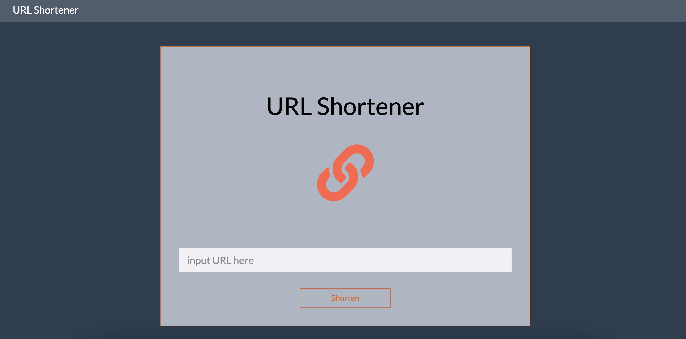
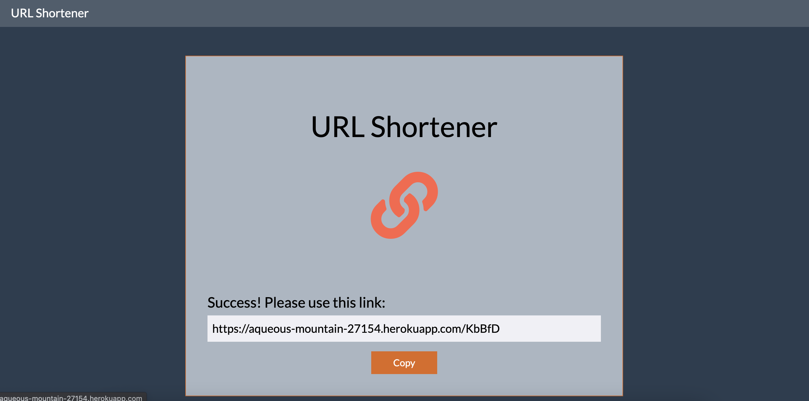

## 短網址產生器 Shorten Url
簡便的短網址產生器

[Heroku 短網址產生器](https://aqueous-mountain-27154.herokuapp.com/)

## 功能
* 使用者在首頁輸入原始網址後，可生產格式化後的短網址。
* 使用者可複製短網址，網址可導向原本的網站。
* 使用者可點選產生的短網址，也可導向原本的網站。

### 首頁


### 短網址


## Getting Started
**Clone respository**
```
$ git clone https://github.com/jilltu330/url-shortener.git
```
**Install by npm**
```
$ npm install
```
**Execute**
```
$ npm run dev
```
**Browse the website on localhost**
```
http://localhost:3000/
```

## Built With
* Node.js (v10.15.0)
* Express (v4.17.1)
* Express-Handlebars (v5.3.2)
* Mongoose (^5.12.14)
* string-random (^0.1.3)


